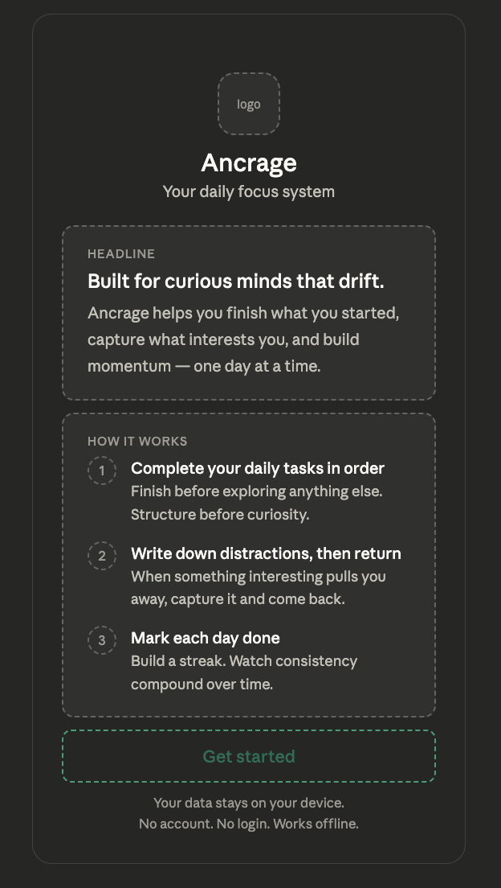

# Screen 01 — Onboarding

## Purpose
Shown once on first visit. User feels safe, 
understands the app in 30 seconds, taps one button.

## UX Review — 3 questions
- Feel: Safe — data stays on device, no account
- Know: What the app does in 3 simple steps
- Do: One tap only — Get started

## Annotations
- **Logic:** "Get started" writes onboarded:true 
  to localStorage. App checks this on every load 
  — if true, skip to Today tab.
- **Logic:** After tap — default blocks written to 
  localStorage, user lands on Today tab pre-filled.
- **UX:** No back button — one screen, one direction, 
  one action. No way to get lost.
- **UX:** Teal only on CTA (call to action, the main 
  button) — first moment brand color appears. 
  Everything else neutral.
- **Copy:** No jargon — "parking lot" not mentioned 
  here, introduced inside the app after user is 
  already oriented.

## Changes from draft
- "Get started — it's free" → "Get started"
- "No account. No login." → "Your data stays on 
  your device. No account. No login."
- "Park your drift" → "Write down distractions, 
  then return"
- "complete tasks in order before exploring" → 
  "Complete your daily tasks in order"

## Why these changes
- Removed "it's free" — redundant, we already said 
  no account
- Added data line — users in 2026 are anxious about 
  privacy, address it directly
- Removed parking lot jargon — context leak, user 
  doesn't know this term yet
- Simplified copy — removed words that added no meaning

## Logic
- "Get started" writes onboarded:true to localStorage
- App checks this flag on every load
- After tap → default blocks written → Today tab

## Wireframe
